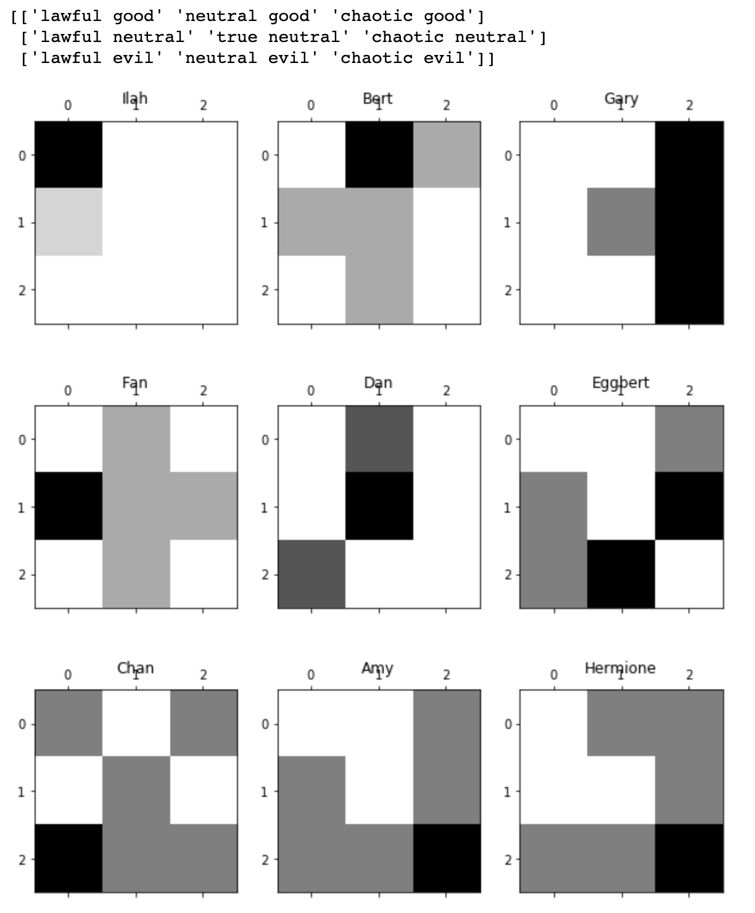
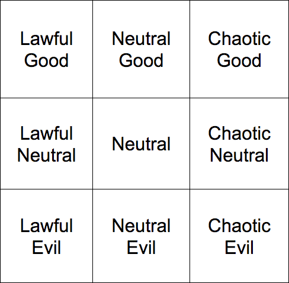
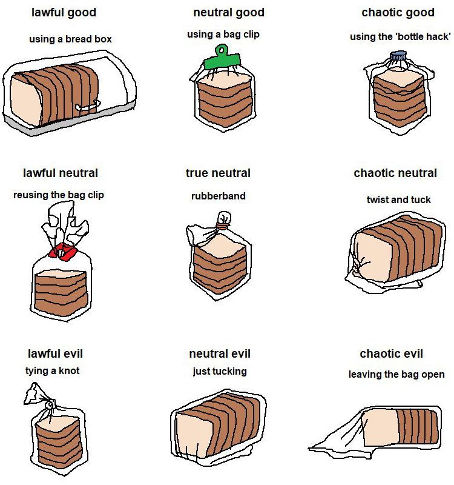
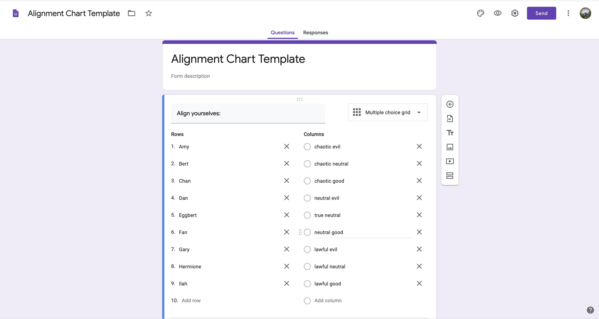
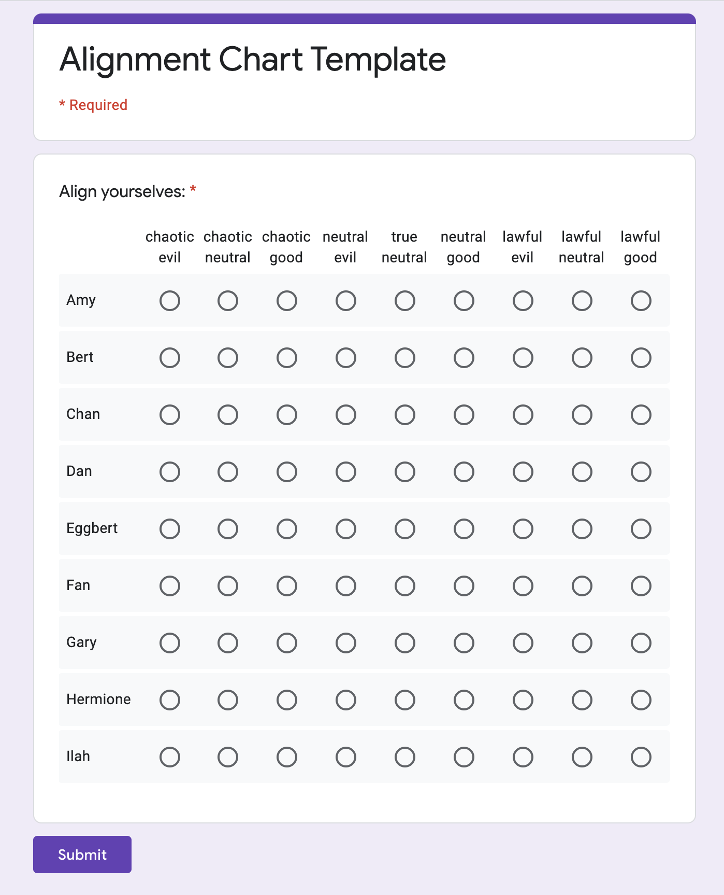

# DnD-Alignment-Chart-Visualizer
Visualizer to help determine your group's D&amp;D alignment chart.

### Background
The original alignment charts came from the game Dungeons and Dragons, you can read more about this [here](http://easydamus.com/alignment.html). Nowadays, these alignment attributes have become largely memes, ubiquitous across social groups and topics.

### Example
1. Create a Google form like [this one](https://docs.google.com/forms/d/e/1FAIpQLScxx_S6Qrvrc7RqJIHDrhSIVG4G8VEy7VzNsM7PsFgBhPAnkg/viewform) (screenshot available in appendix. 
2. 
<!--
-->
### Dependencies
- Python 3.6+
- Pandas 
- Matplotlib

### Appendix

